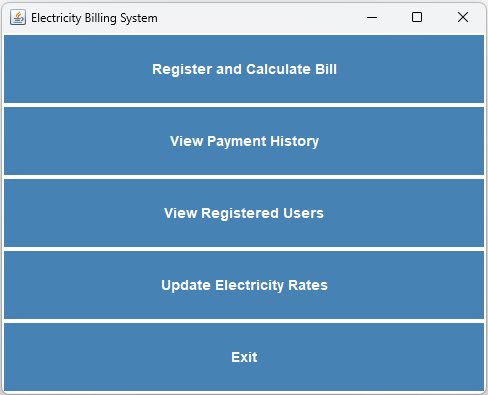
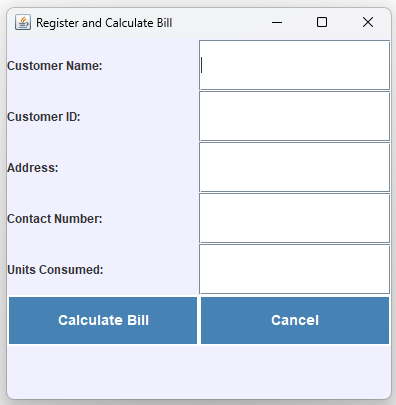
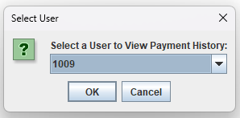
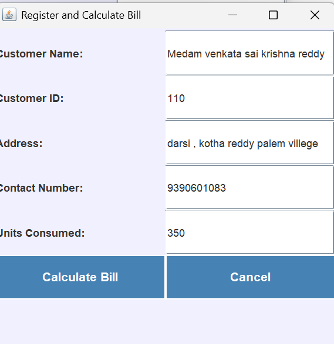
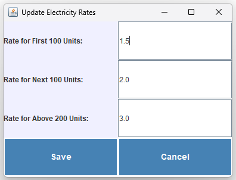

# ⚡ Electricity Billing System (EBS)

- This project implements an **Electricity Billing System (EBS)** using **Java** and **Swing**. 
- The system allows users to register, calculate electricity bills, view payment history, and update electricity rates. 
- The application provides a simple and interactive graphical user interface (GUI) for easy navigation and management of customer data.

## Features

- **Register and Calculate Bill:** Allows users to input customer details (name, ID, address, contact number, and units consumed) and calculates the electricity bill based on predefined rates.
- 📄 **View Payment History**  View the payment history of registered users based on their customer ID.
- 🧾 **View Registered Users**  Displays a list of all registered users in the system.
- ⚙️ **Update Electricity Rates** Admin can update the rates for electricity consumption (for the first 100 units, next 100 units, and above 200 units).
- 🚪 **Exit Program** Displays a "Thank You" message before gracefully exiting the application.

## 💻 Requirements

- **Java 8 or higher**: The system is built with Java and uses Swing for the GUI components.
- **IDE or Command Line**: Any Java IDE (like IntelliJ IDEA or Eclipse) or the command line for compiling and running the program.

## 🧑‍💻 How to Run

1. **Clone the repository:**
   ```bash
   git clone https://github.com/Sai-krishna-reddy-medam/Electricity-Billing-System.git
   ```
2. **Navigate to the project directory**:
   ```bash
   cd ebs-java
   ```
3. **Compile and run the Java program**:
   ```bash
   javac EBS.java
   java EBS
   ```
4. The application will open a GUI where you can interact with the system to register users, calculate bills, view payment history, and update rates.

🧑‍🎓 Usage

- **Register and Calculate Bill:** Input customer details (name, customer ID, address, contact number, units consumed) to calculate the bill.
- **View Payment History:** Select a registered customer ID to view their payment history.
- **View Registered Users:** See a list of all users who have registered in the system.
- **Update Rates:** Admins can modify the electricity rates for different consumption tiers (first 100 units, next 100 units, and above 200 units).

## Technologies Used

- **Java**: Core programming language for implementing the system's logic.
- **Swing**: Java's built-in GUI toolkit for building the user interface.
- **HashMap**: Used for storing registered users and payment history.

## Screenshots

### Main Menu:


### Register and Calculate Bill:


### Payment History:



### Update Rates and Results:


> Note: Screenshots are optional; feel free to add them if you have them.

## License

This project is licensed under the **MIT License** - see the [LICENSE](LICENSE) file for details.

## Contributing

Feel free to fork this project and create a pull request if you wish to contribute. Please make sure to follow the coding standards and provide clear commit messages.


